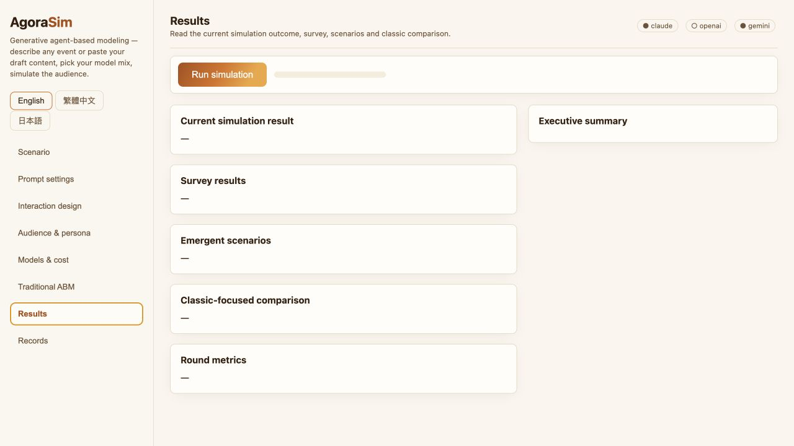

# AgoraSim

**A hybrid agent-based modeling framework for scenario-oriented social reaction analysis.**

AgoraSim resolves natural-language or multimodal artifacts into editable ABM
configurations, runs ratio-controlled populations of LLM, vision-language,
custom-endpoint, random, and classical agents, and compares the same scenario
against matched classical reference dynamics.



## What This Repository Publishes

This upload package is designed for GitHub Pages:

- A polished static project page in [`docs/index.html`](docs/index.html)
- A browser-only illustrative preview that runs without API keys
- Screenshots explaining the workflow
- A downloadable local package for the full AgoraSim system

The public GitHub Pages site is static. It does **not** store API keys, run
LLM calls, upload files, or require a backend server.

## Try The Demo

After publishing with GitHub Pages, visitors can:

1. Open the project page.
2. Try the safe browser-only illustrative preview.
3. Download `agorasim-local-demo-package.zip`.
4. Run AgoraSim locally at `127.0.0.1:8000`.
5. Paste their own Anthropic, OpenAI, or Gemini keys only if they want live
   model calls.

## Included Files

```text
docs/
  index.html                         Static project/demo page
  assets/                            Screenshots used by the page
  downloads/
    agorasim-local-demo-package.zip  Full local runnable package
    PACKAGE_MANIFEST.txt             Package contents and safety notes
```

## Core Features

| Area | What AgoraSim Supports |
| --- | --- |
| Scenario workbench | Artifact-to-configuration workflow for events, populations, action spaces, surveys, networks and model mixes |
| Hybrid agents | Ratio-controlled LLM, VLM, custom-endpoint, random and classical agents using one structured decision schema |
| Interaction protocols | Independent survey, social diffusion, broadcast stream, sequential exposure, focus group and A/B treatment |
| Classical references | Threshold/Bass, Deffuant, SIR, herding, DeGroot/voter and discrete-choice reference dynamics |
| Audit records | Resolved configurations, prompts, decisions, heard statements, model metadata, costs and rule diagnostics |

## Responsible-Use Note

AgoraSim is designed for exploratory scenario analysis, teaching, method
comparison, and baseline construction. Its outputs are synthetic trajectories
under explicit modeling assumptions, not measurements or predictions of real
populations. Claims about precise proportions, subgroup reactions, tipping
points, or individual trajectories require empirical validation beyond the demo.
